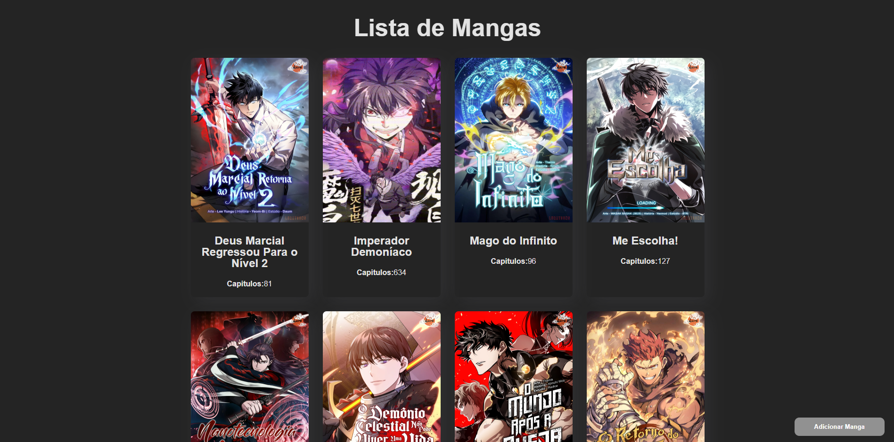
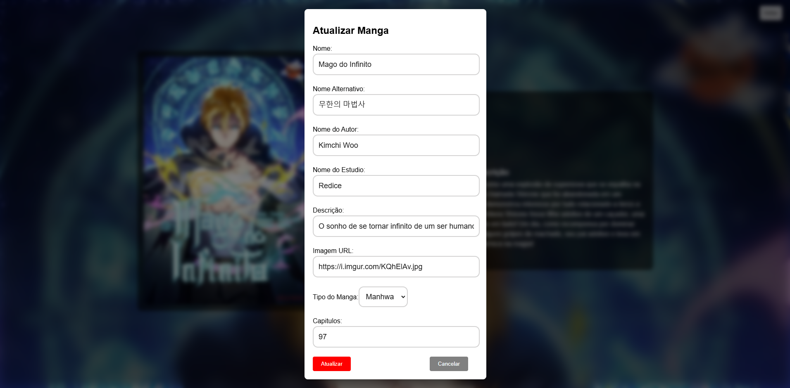

# Lista de Manga - Aplicação Frontend


Essa aplicação foi feita usando **React, React Query e Typescript.**

Essa página foi desenvolvida para meu portfolio, para demonstrar conhecimento em Frontend com React, React Query, Typescript e integração com o Backend.

## Funcionalidades

>

- `Pagina principal` contendo uma lista de mangas adicionados.
<h1 align="center">
    
</h1


- `Adicionar` um botão para adicionar um manga novo ao banco de dados.
<h1 align="center">
    
</h1>


- `Remover` um botão para remover um manga do banco de dados.
<h1 align="center">
    
</h1>


- `Atualizar` um botão para atualizar um manga.
<h1 align="center">
    
</h1>


- `Pagina do Produto` ao clicar no card, abre uma pagina com informações do manga.
<h1 align="center">
    
</h1>

## Instalação

1. Clone o repositorio:

```bash
git clone https://github.com/JustinoLucas/listaManga.git
cd listaManga
```

2. Para instalar as dependências, execute o seguinte comando:
```bash
npm install
```

3. Executando o projeto:
```bash
npm run dev
```

## Integração com Backend

Para realizar a integração com o Backend, você pode clonar o projeto e rodar localmente, ou desenvolver você mesmo

[Link do repositório](https://github.com/JustinoLucas/api-java)


